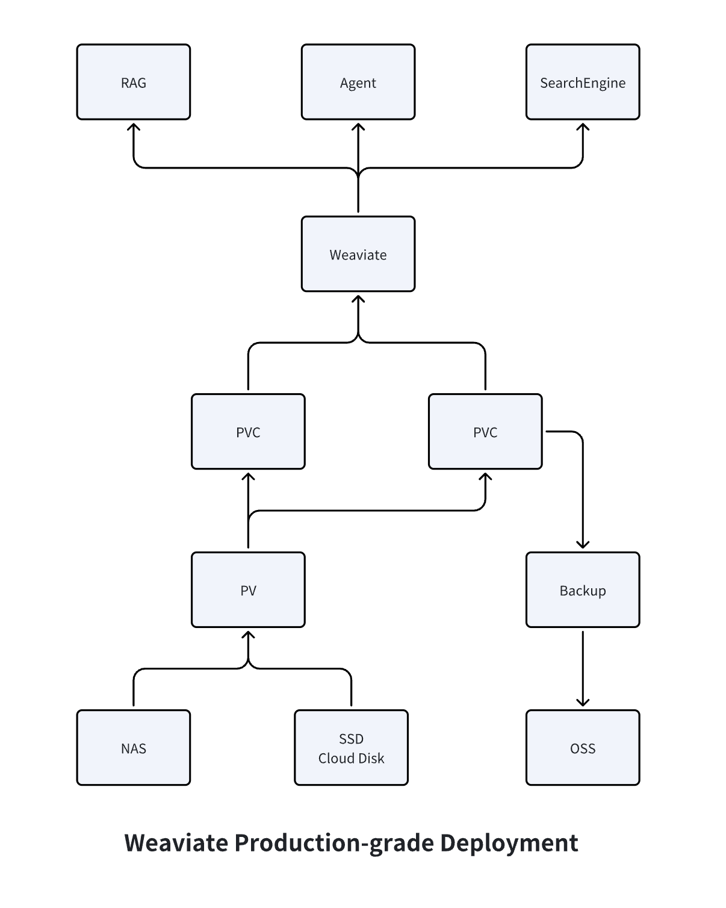

# Weaviate Production-grade Deployment

## Why?

Weaviate is an open-source vector database known for its high performance and ease of use, and is often used in Agent and RAG scenarios.

However, there is no production-grade Weaviate deployment solution available on the cloud. For example, Alibaba Cloud only provides a standalone Weaviate service, which is prone to single points of failure, lacks data backup and recovery, and can easily lead to data loss.

Therefore, this project is based on the official Weaviate Kubernetes deployment solution, combined with Alibaba Cloud ACK, to develop a production-ready Weaviate deployment solution.


## System framework



## How to deploy Weaviate in Cloud Service? (Aliyun for instance)

### Prerequisites

install and configure `kubectl`

### Edit configfile `cp config_template.yaml config.yaml`

```yaml
namespace: default
pv:     # weaviate database persistent storage, NAS for instance
  - name: weaviate-pv-0
    server: 123456.cn-shanghai.nas.aliyuncs.com
    path: /weaviate-0
    storage: 50Gi
  - name: weaviate-pv-1
    server: 123456.cn-shanghai.nas.aliyuncs.com
    path: /weaviate-1
    storage: 50Gi
app:        # weaviate database main program
  name: weaviate
  pvc_name: weaviate-pvc
  replicas: 2   # equal to pv count
  storage: 50Gi # equal to pv size
  image: semitechnologies/weaviate:1.30.0  # In china, use "docker.1ms.run/semitechnologies/weaviate:1.30.0" instead
  init_image: alpine:latest # In china, use "docker.1ms.run/library/alpine:latest" instead
  request_cpu: 1000m   
  request_memory: 1000Mi
  limit_cpu: 2000m
  limit_memory: 2000Mi
  lb_id: lb-123456      # LoadBalancer id
  api_key: weaviate123456

backup:
  name: weaviate-backup
  image: weaviate-backup:1.1  # build from backup/Dockerfile
  oss:      # use object storage system to save backup data
    endpoint: oss-cn-shanghai.aliyuncs.com
    access_key_id: 123456
    access_key_secret: 123456
    bucket: weaviate-backup
    prefix: weaviate-backup/
  cron: "0 0 * * *" # backup time point: Minute, Hour, Day, Month, Day_Of_Week
  src_dirs:
    - dir: /data0
      pv: backup-pv-0
      storage: 50Gi
      subpath: /weaviate-0
      server: 123456.cn-shanghai.nas.aliyuncs.com
    - dir: /data1
      pv: backup-pv-1
      storage: 50Gi
      subpath: /weaviate-1
      server: 123456.cn-shanghai.nas.aliyuncs.com
  cache_dir: .  # save tempory file for backup program

```

### Create LoadBalancer

Weaviate service expose to outside k8s.

Create LoadBalancer in your Cloud dashboard, and get `lb_id`

### Install

#### 1. Create PersistentVolume

```bash
bash 1_create_pv.sh
```

#### 2. Deploy Weaviate

```bash
bash 2_deploy_app.sh
```

#### 3. Build & Push Backup Program Image

```bash
bash 3_build_backup_image.sh
```

#### 4. Deploy Backup Program

```bash
bash 4_deploy_backup.sh
```

#### 5. Test service

```bash
export LB-IP=127.0.0.1  # Your LoadBalancer IP
export API_KEY=weaviate123456 # api-key set in config.yaml
curl http://${LB-IP}:8080/v1/meta -H "Authorization: Bearer ${API_KEY}" | jq
```
